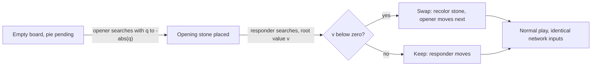
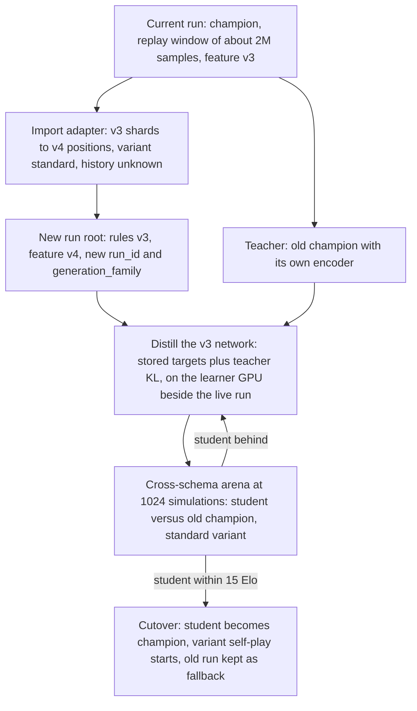

# Variant-Capable Network Plan

Handicap openings, the classic one-stone variant, the pie rule, and architecture v3
for a single GraphResTNet lineage.

Status: implemented locally on branch `variant-capable-network`, 2026-09-03. Every
phase below is code-complete and tested (Rust, Python, TypeScript); nothing has been
deployed or trained on an H100 host yet. The live gates of Section 11 become roadmap
registry entries with pre-registered thresholds before the first Stage A run
(`model-improvement-roadmap.md`), in the same form as R10-LR-RECOVERY-01 through
R10-ANNEAL-HOVER-05.

Implementation summary:

- Phase 0 — rules v3 (`fnv1a64:a5d932b0ef8354e8`): `Variant`, `Action::Swap`, retained
  placement history in `GameState`/`StateKey`, regenerated `conformance-v3.json`
  consumed by Rust, Python, and TypeScript; `star_native`/`star_wasm` variant APIs;
  web `game.ts` handicap and the setup handicap selector.
- Phase 1 — feature schema v4 (19 node planes, 25 scalars, `fnv1a64:cb0e1e89a6ce3540`),
  frozen `features_v3.py` for the previous lineage, D5-invariant pairwise relations in
  `topology.py`, `GraphResTNet` v3 (relational attention bias, adaLN-Zero rule
  conditioning, `rings` forward input, ONNX export), `ModelConfig.legacy`.
- Phase 2 — pie root transform `-|q|` and `root_value`, per-root simulation budgets,
  `VariantMixtureConfig` (standard 0.45 / classic 0.25 / handicap 0.20 / pie 0.10),
  handicap↔pda pairing, swap decision by root value, replay schema v5 with variant
  provenance and teacher targets, segment-stratified replay windows
  (`learner.segment_quotas`), arena mixture segments with veto-on-regress floors
  (result schema v4), monitor/migrator/validator support.
- Phase 3 — `scripts/prepare_lineage_transfer.py` (legacy champion as frozen teacher,
  v4→v5 replay upgrade with soft targets, new run identity) and
  `scripts/run_lineage_arena.py` (cross-schema arena against the legacy champion).
- Phase 4 — starserve API schema v3 (`swap_recommended`, `root_value`, variant,
  optional history, `pda`), web protocol v3 with swap dispatch in both AI controllers,
  browser features v4 pinned to Python via `testdata/star/features-v4.json`, browser
  manifest v3 with the `rings` input, `configs/h100-8gpu-variant-stage-a.yaml` and
  `-stage-b.yaml`, `configs/distill-browser.yaml` v3.
- Capacity (Section 7, item 5) was decided at Stage A rather than deferred to Stage B:
  the shipped profiles use 384 x 8 groups (17,402,775 parameters, about 1.6x the
  inference cost of 384 x 5), because the lineage transfer makes the size free to
  choose at the start and `model` is immutable for the rest of the run.

Design decisions taken during implementation that refine the text below:

- Both server and browser AI received full variant support at once; the browser
  always sends `pda = 0` and real history.
- The pda input is signed per seat: the advantaged seat sees `+d`, the other `-d`,
  and the search gives the advantaged seat `2^d` times the leaf budget clamped to the
  fast/full caps. Handicap games advantage the second player with
  `handicap_pda[k - 2] = (1, 1, 2, 2, 2, 3, 3, 3)`.
- Arena segments never promote: the standard pairs alone drive the sequential test;
  each extra segment aggregates its pairs across rings under the same one-sided
  paired e-process and vetoes (`reject_ring_regression` with
  `regression_source = "segment"`) only once the candidate is provably below the
  segment floor.
- The starserve endpoint namespace stays `/v2/*`; the wire schema and
  `api_schema_version` are 3, and v2 bodies are rejected.
- The lineage transfer keeps `model_step = 0` on transferred shards so they age out
  through `learner.max_replay_lag_steps` without a special retention rule, and the
  Stage A → Stage B profile change is an ordinary continuous-profile migration.

## 1. Requirements

One neural network must play, and be trained on, four rule variants of *Star:

- Standard Double *Star: one stone on the opening turn, then two stones per turn.
- Classic: one stone every turn (the web client already calls this mode
  `classic`).
- Handicap: the first player places up to nine stones consecutively before the
  second player's first turn, as in Go; a one-stone "handicap" is the standard
  game.
- Pie rule: immediately after the first turn the second player may take the
  opener's color (the web client already implements this as `swap`).

Alongside the variants, the network itself should be the strongest design we can
justify for this game, and the training system should follow current best
practice throughout. Section 3 records the review of the present network that
motivates the architecture changes.

## 2. Facts about the current system that shape the design

- The training engine supports exactly one protocol. `training/crates/star-engine/src/lib.rs`
  lines 1-5 state it; `GameState::end_turn` hard-codes `moves_left = 2`
  (`game.rs` line 516); `GameConfig` rejects anything but `mode == "double"` and
  `pie_rule == False` (`training/startrain/config.py` lines 57-71); the canonical
  rules string pins `opening-placements=1; later-turn-placements=2; pie=false`
  (`training/startrain/contracts.py`, `RULES_CANONICAL`).
- The web engine already defines two of the three missing rules with exact
  semantics. `src/lib/star/game.ts` has `Mode = 'classic' | 'double'`
  (`turnSize`, line 60) and the pie swap (lines 145-158): recolor the single
  opening stone to player 1, set `toMove = 0`, advance `turnCount`, and give the
  opener a full turn. The training contract adopts these semantics unchanged so
  web and engine stay in parity; only handicap is new to both.
- Replay shards store raw semantic positions plus targets, not encoded feature
  tensors (`training/startrain/replay.py` lines 551-628; features are encoded at
  collate, lines 860-886). A new feature schema can therefore re-encode the
  existing corpus through an upgrade adapter instead of discarding it. The
  ~600M committed standard-variant samples remain valid standard-variant data.
- Every rules or feature change is a new lineage. `migrate_continuous_profile.py`
  keeps `game`, `model`, `loss`, `optimizer` immutable; checkpoints and shards are
  rejected on `rules_hash` or `feature_schema_hash` mismatch (`checkpoint.py`
  lines 1779-1838, `replay.py` lines 264-269 and 735-741);
  `prepare_champion_warm_start.py` requires an identical `ModelConfig`. There is
  no net2net path, and `distill.py` only trains smaller students with the same
  feature dimensions. The plan therefore adds a lineage-transfer tool
  (distillation warm start) and a cross-schema evaluation contract rather than
  forcing the change through the in-place migration path.
- The search already signs values by `to_move` changes rather than by atomic
  stones (`training/crates/star-search/src/tree.rs` lines 560-585), so
  consecutive placements by one player and one-stone turns back up correctly
  without algorithm changes.

## 3. Review of the current network and training recipe

### 3.1 What is already at or beyond current practice

- Search: Gumbel AlphaZero with Gumbel top-k root sampling, Sequential Halving,
  the sigma(Q) transform (`c_visit` 50, `c_scale` 1.0), completed-Q in-tree
  policies, and completed-Q improved policies as training targets
  (`crates/star-search/src/gumbel.rs`, `tree.rs`). No Dirichlet noise or move
  temperature is needed. This is the best practice for low-simulation self-play.
- Data generation: KataGo-style playout-cap randomization (25% full at 256
  simulations, 75% fast at 32), fast-ply policy targets at weight 0.25,
  clinch finalization with exact outcomes, D5 dihedral augmentation of every
  node-indexed target.
- Auxiliary heads: two-class outcome (value = P(win) - P(loss)), 303-bin score
  margin distribution, three-class ownership, alive, and a KataGo soft policy at
  temperature 4. Loss weights 1.0 / 1.0 / 0.25 / 0.25 / 0.1 / 0.25.
- Trunk hygiene: pre-norm RMSNorm, SwiGLU, bias-free projections, layer-scale
  residuals initialized at 1e-2, grouped-query attention (12 query heads, 3 KV
  heads) through fused scaled-dot-product attention, one shared network across
  ring sizes 4-10 via padding and masks.
- Optimization and systems: Muon (Newton-Schulz, Nesterov) for trunk matrices
  with AdamW for the rest, weight decay 0.01, bf16 autocast, `torch.compile`,
  EMA 0.9999, gradient clipping at 1.0, update-to-data control (1.5), an
  anytime-valid e-process promotion gate, and non-compounding learning-rate
  governance with staged recovery and restore-on-promotion.

### 3.2 Gaps, in order of expected impact

1. No relational or positional structure inside attention. The global blocks
   see a bag of nodes; geometry enters only through node features (ring
   fraction, arm distance, degree, flags) and three typed edge classes in the
   local blocks. The local path covers ten message-passing hops in total while
   tangential distances on ring 10 reach 25. A connection game is about paths;
   the network should be able to attend by relation. Leela Chess Zero's attention
   nets gained most from exactly this kind of structure (smolgen and relative
   biases); graph transformers use shortest-path or structural biases
   (Graphormer). The roadmap lists a D5-invariant graph-relative bias as Phase 3
   but deferred it.
2. Capacity. 10.48M parameters and fifteen layers at ~420M examples consumed is
   plausibly under-capacity for a 275-node board with two-placement turns.
   KataGo grew its networks (b6 to b10 to b15 to b20 to b40) precisely when the
   frontier saturated at a size. The learner GPU is idle most of the time even at
   UTD 1.5; actor inference is the constraint.
3. Inputs lack turn history. Because the state is Markov, history is not
   required, but with two placements per turn the policy cannot see which stone
   its own turn just placed, which matters for coordinating a pair. KataGo keeps
   recent-move planes even though Go is Markov.
4. The AdamW group (heads, embeddings, norms) runs at 4.5e-6, far below common
   practice; heads adapt slowly to the trunk. The Muon reference runs 66x below
   the implementation's natural 0.02 after the 5e-3 collapse. Both are
   hypotheses to test, not findings.
5. Policy-surprise sample weighting is implemented but disabled on the
   production profile.

### 3.3 Restore-to-reference after promotion

The learning-rate cycle observed on 2026-09-03 is relevant to the recipe: after
the promotion of 799,630 restored Muon to 3.0e-4, the next two candidates were
conclusively rejected at -66.8 and -100 Elo against the new champion within
three hours, before the streak pulled the rate back to 1.5e-4. For a converged
model the full-rate phase is destructive. The recipe in section 8 therefore caps
the restore multiplier (`restore_learning_rate_scale`) so the cycle runs between
half the reference and the floor.

## 4. Rules contract v3 and engine (Phase 0)

### 4.1 Contract

One `rules_hash` identifies the whole variant family; per-game parameters live in
the semantic key and in every sample.

- Extend `RULES_CANONICAL` to `double-star/rules-v3` in `src/lib/star/rules.ts`
  (the canonical bytes live there) and mirror it in
  `training/startrain/contracts.py` and `training/crates/star-engine/src/lib.rs`
  (`RULES_VERSION`, `RULES_SCHEMA`, `RULES_HASH`, `RULES_HASH_VALUE`).
- New clauses, in this order after `bridge=...`:
  `modes={classic:turn-size-1,double:opening-1-then-2};`
  `handicap=k-consecutive-opening-placements-by-player0,k-in-1..9,k=1-is-standard;`
  `pie=optional:after-first-turn-player1-may-swap,recolor-opening-stones-to-player1,player0-moves-next-with-full-turn,swap-unavailable-after-any-placement;`
  `handicap-excludes-pie;` `variant-in-semantic-key=mode,handicap,pie;`
  `actions=atomic-place|swap;` `action-wire=place(node)->node,swap->node-count;`.
  Scoring, terminal, D5, outcome, and score-margin clauses are unchanged.
- Sites that compare or persist the hash keep working with the single new
  constant: `replay.py`, `replay_store.py`, `checkpoint.py` (manifest wire and
  payload), `learner.py` manifests, `native.py`, `distill.py`,
  `starserve/config.py`, `starserve/schemas.py`, `starserve/snapshot.py`,
  `starserve/app.py`, `publish.py` asset names, and the conformance fixtures.
- `GameConfig` gains `variants` (allowed modes, handicap range, pie allowed) and
  drops the `mode == "double" and not pie_rule` lock; `mode` remains as the
  default for contexts that need one.

### 4.2 Engine (`training/crates/star-engine`)

- `GameState` gains `mode`, `handicap: u8` (1..=9), `pie: bool`,
  `swap_available: bool`, `swapped: bool`, and `previous_turn_moves` (the last
  completed turn's placements, up to nine, with a length) for the history planes.
  `new(board, rules)` sets `moves_left = handicap` with `opening = true`.
  `end_turn` sets `moves_left = turn_size(mode, turn_count)` (1 for classic, 2
  for double) and, after the first completed turn of a pie game,
  `swap_available = true`.
- `Action` becomes `Place(NodeId) | Swap`. `Swap` is legal only while
  `swap_available`; it recolors the opening stone to player 1, sets
  `to_move = Zero`, advances `turn_count`, sets `moves_left = turn_size`,
  `swapped = true`, `swap_available = false`. Any placement clears
  `swap_available`. The wire code for `Swap` is `node_count`, one past the last
  node, so the nodes-only action layout is preserved for placements. The network
  never emits `Swap` (section 6.2).
- `from_parts` validation generalizes: opening implies `to_move == Zero`, only
  player-0 stones, `stones[0].count() == handicap - moves_left`, and
  `moves_left in 1..=handicap`; outside the opening `moves_left in 0..=turn_size`.
- `StateKey` adds `mode`, `handicap`, `pie_pending` (opening of a pie game with
  no stones yet), `swap_available`, and the current-turn and previous-turn
  placement sets, because history planes make positions that differ only in
  history distinct inputs. The transposition table keys on it (`tree.rs` lines
  420-437); `{a,b} == {b,a}` within a turn still merges.
- `star-py`: `StateBatch(rings, batch_size, variant=...)` and `from_semantic`
  accept the new fields, `StateData` exposes them, `apply_many` accepts the swap
  code.
- Web parity: `src/lib/star/game.ts` adds handicap (opening `movesLeft =
  handicap`, `canSwap` only when `handicap == 1`), `conformance.ts` accepts swap
  and variants, `src/lib/star/ai/protocol.ts` and `controllers.ts` stop
  rejecting pie and classic for the AI.

### 4.3 Tests

- Property tests per variant: legal moves, undo, terminal at full board, turn
  sizes, opening validation.
- Swap semantics checked against the web reducer through the conformance
  harness.
- D5 symmetry of every new key field.
- A relabeling test: the swapped position equals the unswapped position with
  colors exchanged, and the network's encoded inputs are identical for the two.

## 5. Feature contract v4 (Phase 1)

`startrain/features/v4`, `FEATURE_SCHEMA_VERSION = 4`, computed at collate from
the semantic key as today (`features.py`, `encode_position`).

- Node planes (15 to 20). Keep the fifteen existing planes. Add
  `placed_this_turn` (the current player's placements in the unfinished turn),
  `opponent_previous_turn` (the opponent's last completed turn),
  `own_previous_turn` (the current player's last completed turn),
  `handicap_stone` (placed during the opening phase), and `last_placement` (the
  single most recent stone). Every new plane is a permutation of a node set, so
  D5 equivariance holds once `symmetry.py` `transform_position` permutes the new
  sets too.
- Global scalars (17 to 25). Keep the seventeen. Add `turn_size / 2`,
  `handicap / 9`, `handicap_phase` (1 during the opening of a k >= 2 game),
  `handicap_remaining / 9`, `pie_pending` (1 at the empty board of a pie game),
  `swap_available`, `history_known` (0 for upgraded legacy samples whose turn
  history is unknown), and `playout_doubling_advantage / 3` (section 6.3).
  `moves_left_fraction` becomes `moves_left / max(turn_size, handicap)`.
- Legacy compatibility. `replay.py` gains a versioned decoder. Shards carrying
  the v3 feature hash and rules v2 are upgraded in memory to v4 positions with
  `mode = double`, `handicap = 1`, `pie = false`, empty turn-history sets, and
  `history_known = 0`. The learner's hash check becomes "current hash or a hash
  in the upgrade table"; `ReplayStore` commits keep rejecting unknown hashes.
  Window selection (`recent_samples_per_ring`) is unchanged, so the recent
  standard-variant window feeds the new network from its first step.
- `ModelConfig` keeps its exact-equality check against `NODE_FEATURE_DIM` and
  `GLOBAL_FEATURE_DIM`, which move to 20 and 25.

## 6. Search and game-generation semantics (Phase 2)

### 6.1 Handicap and classic

No search algorithm change. Values are signed by `to_move` changes, so k
consecutive placements and one-stone turns back up correctly. The handicap
phase uses ordinary search over empty nodes with the usual ring-scaled
`max_considered`.

### 6.2 Pie: the swap is a value decision, not a policy output

The position after a swap is the unswapped position with colors exchanged, so
for a current-player-perspective network the two are the same input. Let v be
the search value, for the side to move, of the position after the opening stone
(the responder's value). The second player gains v by keeping and -v by
swapping, so the swap is taken exactly when v < 0. The opener therefore faces
payoff -|v| for each opening candidate and should play the most balanced stone.

- Root transform. When the root is a pie-pending empty board, `star-search` maps
  each root child's backed-up value q to `-|q|` for selection and for the
  completed-Q policy target. Deeper nodes are unchanged; this is the exact
  minimax value under an optimal swap decision.
- Swap decision. After the first turn of a pie game, self-play and the arena run
  the standard search on the position and apply `Swap` iff the root value is
  below zero, with a dead zone of +-0.02 so balanced openings are not decided by
  noise. Recorded per game in provenance.
- Network visibility. Only `pie_pending` changes the network's task (the opening
  policy target and the empty-board value). `swap_available` is included for
  completeness; no swap logit is ever produced.
- Value targets stay "outcome for the color to move", which is well defined
  regardless of which seat held which color.



### 6.3 Playout doubling advantage and score utility for lopsided positions

A nine-stone handicap decides most equal-strength self-play games before they
start: outcome targets saturate and the disadvantaged side receives no gradient.
Adopt KataGo's two remedies.

- Score utility. `InferenceConfig.score_utility_weight` (already implemented in
  `inference.py` lines 303-327; 0.05 in the H100 profiles) rises to 0.15-0.30
  for handicap games so search still discriminates among losing moves. The
  weight becomes a per-variant profile field.
- Playout doubling advantage (pda). In a configurable fraction of games one side
  receives `2^pda` times the simulations (pda in {-2, -1, 1, 2}) and the
  network receives pda for that side as an input. The network learns to evaluate
  positions under a strength asymmetry. At inference against a weaker opponent
  in a handicap game, the client sets pda to the assumed advantage and gets
  realistic, aggressive play instead of resignation-grade values.
- Handicap self-play pairs k with a pda for the second player drawn to roughly
  balance outcomes (k 2-3: pda 1; k 4-6: pda 2; k 7-9: pda 3), recorded per
  game.

### 6.4 Arena and gating

- Every arena pair carries a variant. Both games of a role-reversed pair share
  it; for handicap, both players take the handicap seat once. `promotion.py`
  result files record `variant` in the `search` block next to the existing
  `pie_rule` field.
- The primary promotion gate stays on the standard variant at 256 simulations
  with the existing e-process, so the Elo ladder remains comparable.
- Variant coverage uses regression floors: the per-ring floor machinery
  (`required_regression_rings`, `per_ring_regression_floor_elo`) generalizes to
  segments. `classic`, `handicap-5` (both seats), and `pie` must not fall below
  -25 Elo against the champion in their own segment before a promotion is
  allowed.
- Measurement crossplay (`historical_evaluation.py`) runs per segment at 1024
  simulations after each promotion, giving one ladder per variant.
- Pie fairness metric: the distribution of the opener's chosen |v| across arena
  pie games, reported by `strength_efficiency_report.py`. A healthy network keeps
  it near zero.

## 7. Architecture v3 (Phase 1; capacity in Stage B)

The GraphResTNet family in `training/startrain/model.py` stays. A graph-native
trunk is the right family for a pentagonal ring board, and its global token is
exactly where rule context belongs. Changes in priority order:

1. Relational attention bias (the largest gap). In `GlobalGQABlock` add a
   D5-invariant relative bias `bias[h, rel(i, j)]`, where `rel` indexes a small
   learned table keyed by ring difference (clamped to [-9, 9]), D5-canonical
   angular offset bucket, same-sector flag, and shortest-path-distance bucket
   (0 to 12+), plus dedicated relations for token-to-node and node-to-token.
   `rel(i, j)` is precomputed once per ring size in `topology.py` and travels
   with the batch like `neighbor_index`; the bias is added through the float
   `attn_mask` of scaled-dot-product attention. Cost: a few thousand parameters
   and an N x N x H additive mask per layer (about 0.9 GB transient at batch 512
   on ring 10; measured before shipping). Tests: bias invariance under all ten
   D5 transforms.
2. Rule conditioning via adaLN-Zero. A shared two-layer MLP maps the global
   vector (all 25 scalars: variant, handicap, pie, pda, and the existing
   globals) to per-block scale and shift applied to the RMSNorm output of every
   local block, initialized to the identity. The global token still carries
   context through attention; adaLN gives local message passing direct access to
   the variant without waiting for a global block. About 0.2M parameters.
3. Inputs: node projection 20 to width, global projection 25 to width.
4. Heads unchanged: policy, soft policy, two-class outcome, 303-bin score
   margin, ownership, alive. Ties remain invalid; no swap logit.
5. Capacity (Stage B). Per-group cost is about 14 x width^2 parameters
   (2 x width^2 per local block, about 10 x width^2 per global block).
   Candidates: width 384 x 8 groups (about 16.8M parameters, 1.6x today) and
   width 512 x 6 groups with GQA 16/4 (about 22M, 2.1x). Because actors run at
   75-85% GPU while the learner is mostly idle, a switch is justified only if
   Elo per generated sample rises more than samples per second falls. Stage A
   ships v3 at 384 x 5 so the structural changes are measured alone; the
   distillation bridge (section 10) makes the capacity switch cheap to try.
6. `model_parameter_counts` covers the bias tables and adaLN MLP;
   `MODEL_SCHEMA_VERSION` becomes 3.

## 8. Training recipe (Phase 2)

### 8.1 Variant mixture and data balance

- Per-game sampling in `selfplay.py` from a profile block `selfplay.variants`:
  standard double 0.55, classic 0.20, handicap 0.15 (k uniform in 2..9 with pda
  pairing), pie 0.10 (double 0.07, classic 0.03). Asymmetric-pda games form 20%
  of standard games in addition. All fractions are migratable profile fields.
- Replay sampling stratifies by ring and variant (`UniqueReplayBatchSampler`
  quotas) with inverse-frequency sample weights capped at 2x, so rare variants
  are neither drowned nor dominant. Per-head loss weights are unchanged.
- Provenance: `SelfPlayIdentity` and every sample record `mode`, `handicap`,
  `pie`, `swapped`, and `pda`; the strength report and monitor summarize
  throughput and Elo per variant.

### 8.2 Optimizer, schedule, and controls

- Keep Muon+AdamW, bf16, `torch.compile`, EMA 0.9999, gradient clip 1.0, batch
  512, D5 augmentation, UTD 1.5 (raise to 2.0 after the first promotion if the
  loss trend holds).
- Muon reference 3.0e-4 with the existing governor: staged recovery by 0.5 per
  streak to the 0.25 floor, `count_inconclusive_rejections` on, and
  `restore_learning_rate_scale` 0.5 so promotions restore to half the reference
  (section 3.3).
- Raise the AdamW group (heads, embeddings, norms, adaLN, bias tables) from
  4.5e-6 to 3.0e-5; heads must learn the new variants quickly. Warmup 2000 steps
  at the transfer.
- Enable policy-surprise sample weighting (`policy_surprise_weight` 0.5, cap
  4.0).
- Keep Gumbel settings (256/32 simulations, ring-scaled `max_considered`,
  `c_visit` 50, `c_scale` 1.0) and completed-Q targets with fast-ply policy
  weight 0.25.

## 9. Serving and clients (Phase 4)

- `starserve/schemas.py` request v3: `mode`, `handicap`, `pie`,
  `swap_available`, `swapped`, turn-history sets, optional `pda`. Health
  advertises rules v3 and feature v4; `snapshot.py` and `app.py` validate against
  the new constants.
- Browser distillation exports (`distill.py`, `publish.py`) carry the new input
  layout; `src/lib/star/ai/features.ts` mirrors feature v4.
- The swap decision is exposed as a server-side recommendation
  (`swap_recommended` with the root value) so clients never need a swap logit.

## 10. Lineage transfer: distillation warm start instead of scratch (Phase 3)



- New tool `scripts/prepare_lineage_transfer.py`: creates the new root with a
  fresh `RunIdentity`, imports the recent replay window through the upgrade
  adapter into v5 shards (about 2M samples across rings), writes the teacher
  reference, and prepares a distillation checkpoint. `distill.py` is generalized
  to allow a larger student and a teacher with a different feature encoder (each
  side encodes from the semantic position).
- Distillation runs on GPU 0 beside the live learner (36 GB of 80 GB used; the
  live learner is idle most of the time) for 6-12 hours with the production
  losses plus per-head KL to the teacher.
- Cross-schema evaluation. `checkpoint.py`'s `evaluation_contract` splits into a
  game contract (rules, action layout, scoring) that must match and a per-model
  input contract (feature schema) that may differ; `arena.py` in
  `--evaluation-mode=architecture` encodes each side with its own encoder. The
  same mechanism later measures every architecture change against the previous
  lineage on the 1024-simulation ladder.
- Cutover follows the R1 procedure: immutable release, fork-style root, warm
  start with a fresh optimizer segment, continuity manifest, disaster-recovery
  namespace, verification. The old run stays as `fallback-lkg`.

## 11. Evaluation gates and risks

Phase gates:

- Phase 0: engine property tests and web conformance green.
- Phase 1: the v3 network trains on upgraded legacy shards with loss within 5%
  of the current learner at equal steps and passes the D5 bias-invariance tests.
- Phase 2: self-play produces every variant at the configured mix, pie games
  swap in 40-60% of cases, handicap-9 games are not one-sided under pda pairing.
- Phase 3: the student is within 15 Elo of the current champion at 1024
  simulations on the standard variant before cutover.
- Phase 4: first promotion within 24 hours of cutover; per-variant floors hold.

Risks and mitigations:

- Dilution of the standard-variant frontier: 55% share, per-variant floors, one
  ladder per variant.
- Handicap value saturation: pda plus score utility.
- Pie opening degeneracy: fairness metric and root-transform tests.
- Replay invalidation: the upgrade adapter keeps the window; full-corpus
  re-encoding is unnecessary.
- Memory of the N x N attention bias at batch 512: measured in the learner
  benchmark before Stage A ships.
- Serving clients breaking on the hash bump: versioned schema, old endpoint kept
  until the browser export ships.

## 12. Effort

- Phase 0 (engine, contracts, web parity): 3-4 days.
- Phase 1 (features, architecture v3, tests): 2-3 days.
- Phase 2 (pie transform, pda, variant self-play, replay adapter, sampler, arena
  segments): 3-4 days.
- Phase 3 (transfer tool, distillation run, cross-schema arena): 2 days plus
  6-12 hours of compute.
- Phase 4 (cutover, serving, monitoring): 2 days.

About three weeks end to end. The current run keeps improving throughout and is
untouched until the cutover.

## Appendix A. Files by phase

Phase 0
- `src/lib/star/rules.ts`, `src/lib/star/game.ts`, `src/lib/star/conformance.ts`,
  `src/lib/star/ai/protocol.ts`, `src/lib/star/ai/controllers.ts`
- `training/startrain/contracts.py`, `training/startrain/config.py`
- `training/crates/star-engine/src/lib.rs`, `game.rs`, `scoring.rs` (unchanged
  semantics, new tests), `training/crates/star-py/src/lib.rs`
- Conformance fixtures and `test_native_e2e.py`

Phase 1
- `training/startrain/features.py`, `topology.py` (relation index),
  `symmetry.py`, `replay.py` (versioned decoder), `replay_store.py`
- `training/startrain/model.py` (`GraphResTNet` v3, `GlobalGQABlock` bias,
  adaLN), `checkpoint.py` (`MODEL_SCHEMA_VERSION` 3)
- `tests/test_topology_features.py`, `tests/test_pipeline_core.py`, new model
  tests

Phase 2
- `training/crates/star-search/src/gumbel.rs`, `tree.rs`, `batch.rs` (pie root
  transform, pda budgets)
- `training/startrain/selfplay.py`, `actor.py`, `inference.py`,
  `learner.py` (sampler quotas), `arena.py`, `promotion.py`,
  `historical_evaluation.py`, `strength_efficiency_report.py`,
  `scripts/monitor_run.py`, `scripts/validate_continuous_profile.py`,
  `scripts/migrate_continuous_profile.py` (allowlist)

Phase 3
- `scripts/prepare_lineage_transfer.py` (new), `training/startrain/distill.py`,
  `checkpoint.py` (evaluation contract split), `arena.py`, `cli.py`

Phase 4
- `training/starserve/schemas.py`, `config.py`, `snapshot.py`, `app.py`,
  `runtime.py`; `scripts/publish.py`; `src/lib/star/ai/features.ts`;
  `docs/serving-and-distillation.md`, `docs/production-h100-training-runbook.md`

## Appendix B. Pre-registration template for each phase

```text
ID: R11-VARIANTS-0<phase>
Phase: <0..4>
Hypothesis: <one sentence>
Commit / Release: recorded at cutover
Control: <previous lineage or previous phase>
Treatment: <exact profile and code diff>
System gates: <from section 11>
Statistical gate: <Elo per hour on the standard ladder; per-variant floors>
Result: pending
Decision: pending
```
